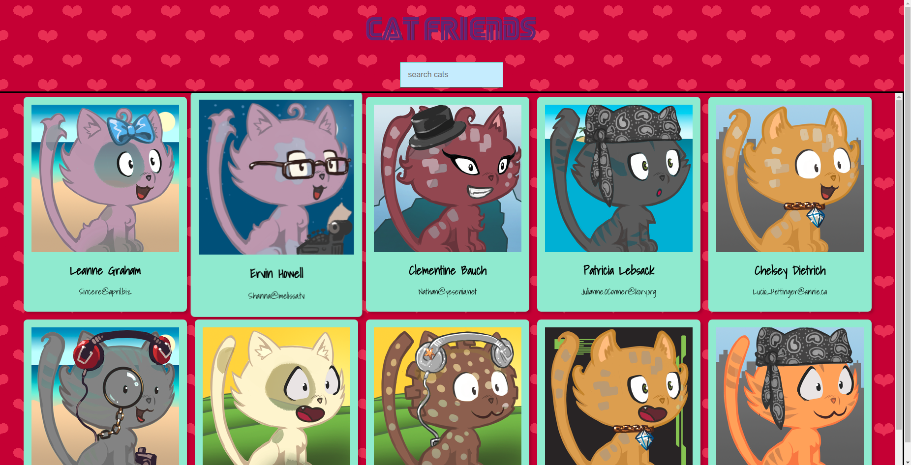

# Catfriends 



[](https://github.com/skojic/robofriends/network)

[](https://github.com/skojic/robofriends/stargazers)
 

Simple react app created for my daughters to play with robots and cats.


[](https://twitter.com/intent/tweet?text=Wow:&url=https%3A%2F%2Fgithub.com%2Fskojic%2Frobofriends)

## Getting Started

Clone the repo, or download zip file, run ```npm i``` to install dependencies and npm_modules, or if you are on a Linux/Unix systems type in ```sudo npm i```

### Prerequisites


```
- npm (node package manager)
```


## Using the application

type in the name of the cat or robot to filter out the one you like.


## Deployment

Application deployed using heroku (https://dashboard.heroku.com)

## Built With

* React
* Javascript
* robofriends API

## Versioning

This is not supported project anymore, it is built purely for practice and fun.

## Authors

* **Srdjan Kojic**

[](https://twitter.com/intent/tweet?text=Wow:&url=https%3A%2F%2Fgithub.com%2Fskojic%2Frobofriends)

## License

This project is licensed under  
[](https://github.com/skojic/robofriends)


